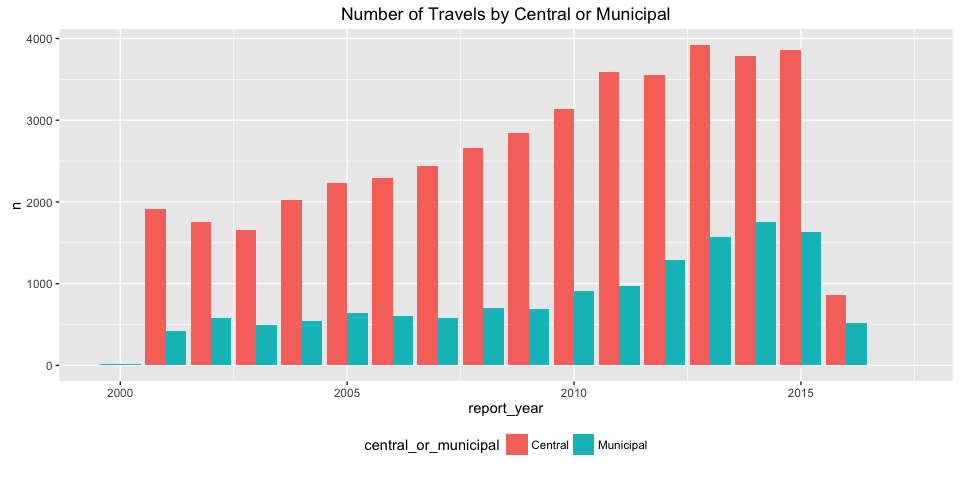
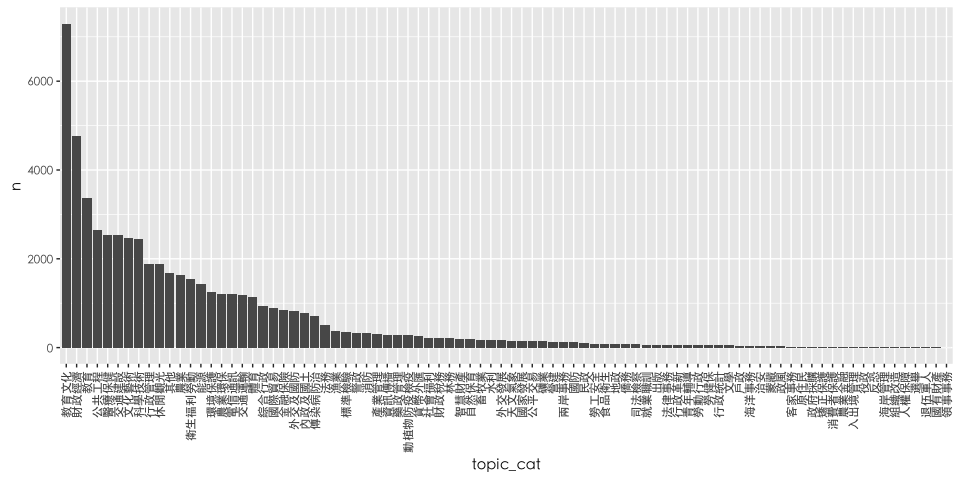

# 探索公務出國報告
Chin-Cheng Liang  
September 6, 2016  


在丁新一建立起 [公務出國報告查詢統計網](http://catding.twbbs.org/report/index.php) 之後，更多人注意到了公務出國報告這個專案。我想進一步讓有興趣參與者，能夠快速上手分析資料，因此重製王宏恩菜市場政治學的文章 [在爬完近六萬筆的公務出國報告後，我們發現什麼趨勢？](http://whogovernstw.org/2016/09/01/austinwang18/) 裡面所有的圖表。

另外，王宏恩也提出了許多有趣的 [研究方向](https://g0v.hackpad.com/E0G6gZDQ2ZZ#:h=統計資料可以進行的研究(想到什麼就打什麼)-0821) ，歡迎接力做下去。

建議的重製方式是 clone 下存有所有原始碼的 [Repository](https://github.com/ChihChengLiang/reproduce_gov_travel_reports)，在 [Rstudio](https://www.rstudio.com/) 中用 "Open project" 選擇 `gov_travel_reports.Rproj` 。最後執行 `index.Rmd` 中的程式碼。若您不熟悉 git 與 Rstudio ，可直接把程式碼複製貼上 R 指令列執行即可。

若有任何重製上的困難可開 [issue](https://github.com/ChihChengLiang/reproduce_gov_travel_reports/issues) ，我會回覆您。若是程式碼的問題請在 issue 中附上錯誤訊息以及系統資訊 sessionInfo 如下：


```r
sessionInfo()
```

```
## R version 3.3.1 (2016-06-21)
## Platform: x86_64-apple-darwin13.4.0 (64-bit)
## Running under: OS X 10.11.6 (El Capitan)
## 
## locale:
## [1] zh_TW.UTF-8/zh_TW.UTF-8/zh_TW.UTF-8/C/zh_TW.UTF-8/C
## 
## attached base packages:
## [1] stats     graphics  grDevices utils     datasets  methods   base     
## 
## loaded via a namespace (and not attached):
##  [1] magrittr_1.5       formatR_1.4        tools_3.3.1       
##  [4] htmltools_0.3.5    yaml_2.1.13        Rcpp_0.12.6       
##  [7] stringi_1.1.1      rmarkdown_1.0      knitr_1.14        
## [10] stringr_1.0.0.9000 digest_0.6.10      evaluate_0.9
```

若有更好的修改，懇請惠賜 PR ！

在開始前，請先確認安裝了所有套件


```r
# install.packages("devtools")
# devtools::install_github("ChihChengLiang/abroadplayr")
library(abroadplayr) 
library(dplyr)
library(lubridate)
library(magrittr)
library(ggplot2)
```

# 整理資料

[abroadplayr](https://github.com/ChihChengLiang/abroadplayr) 套件已把近五萬筆的資料包在 reports 這個 Dataframe 中，可直接取用。但為了後面的分析，還需做一點小小的處理。


```r
reports_clean <- reports %>%
  tbl_df %>%
  mutate_each(funs(ymd), report_date, start_date, end_date) %>%
  mutate(
    report_year = year(report_date),
    start_month = month(start_date),
    central_or_municipal =
      if_else(gov=="中央政府", "Central", "Municipal")
    )
reports_clean %>% glimpse()
```

```
## Observations: 56,593
## Variables: 30
## $ gov                  <chr> "中央政府", "中央政府", "中央政府", "中央政府", "中央政府", "...
## $ id                   <chr> "C08906388", "C08905663", "C08803138", "C...
## $ plan_name            <chr> "參加亞太科技協會與日本亞東科技協會", "國際採購及材料管理", "赴法出席泛歐...
## $ report_name          <chr> "參加亞太科技協會與日本亞東科技協會", "國際採購及材料管理", "赴法出席泛歐...
## $ main_file            <chr> "http://report.nat.gov.tw/ReportFront/rep...
## $ other_file           <chr> "", "", "", "", "", "", "", "", "", "", "...
## $ report_date          <date> 2001-01-10, 2001-01-09, 2001-01-09, 2001...
## $ report_page          <int> 13, 23, 0, 19, 1, 67, 0, 0, 20, 1, 7, 48,...
## $ office               <chr> "中國石油股份有限公司", "中國石油股份有限公司", "中華電信股份有限公司",...
## $ member_name          <chr> "謝榮輝", "吳蕭金", "李東興", "林家葳", "楊介福,鄧台雄", "黃...
## $ member_office        <chr> "中國石油股份有限公司", "中國石油股份有限公司", "中華電信股份有限公司長途...
## $ member_unit          <chr> "總公司", "材料處", "行通處", "第二組", ",", "執行書室", ...
## $ member_job           <chr> "副總經理", "組長", "工程師", "技士", "檢核師,檢核師", "秘書...
## $ member_level         <chr> "其他", "其他", "委任", "薦任", "其他,其他", "簡任", "其...
## $ member_num           <int> 1, 1, 1, 1, 2, 1, 5, 1, 5, 1, 3, 2, 1, 2,...
## $ start_date           <date> 2000-10-16, 2000-09-24, 1999-03-22, 2000...
## $ end_date             <date> 2000-10-21, 2000-10-08, 1999-03-28, 2000...
## $ area                 <chr> "日本", "美國", "法國", "美國", "越南", "荷蘭", "緬甸",...
## $ visit                <chr> "", "", "", "", "", "", "", "", "", "", "...
## $ type                 <chr> "其他", "其他", "其他", "其他", "其他", "其他", "其他",...
## $ keyword              <chr> "亞太/東亞科技協會,核能發電,再生能源,石油工業,超低硫之汽油及柴油", "經濟...
## $ note                 <chr> "", "", "", "", "", "", "", "", "", "", "...
## $ topic_cat            <chr> "公共工程", "財政經濟", "電信通訊", "農業", "農業", "財政經濟...
## $ adm_cat              <chr> "工程管理", "經濟貿易", "電信", "農糧", "農糧", "經濟貿易",...
## $ summary              <chr> "第十八屆亞太科技協會/日本亞東科技協會聯席會議及日本石油學會第廿屆石油煉製技術會...
## $ word                 <chr> "參加,亞太,科技,協會,與,日本,亞東,科技,協會", "國際,採購,及,材料,...
## $ wiki_page            <int> 0, 0, 0, 0, 0, 0, 0, 0, 0, 0, 0, 0, 0, 0,...
## $ report_year          <dbl> 2001, 2001, 2001, 2001, 2001, 2001, 2001,...
## $ start_month          <dbl> 10, 9, 3, 11, 12, 11, 9, 10, 12, 11, 8, 1...
## $ central_or_municipal <chr> "Central", "Central", "Central", "Central...
```

# 每年有多少公務出國呢？


```r
reports_clean %>%
  count(report_year) %>%
  filter(report_year<= 2016 & !is.na(report_year)) %>%
  ggplot(aes(x=report_year, y=n)) +
  geom_bar(stat = "identity") +
  ggtitle("Annually Number of Travels")
```

<!-- -->

# 中央政府與地方政府的比例


```r
reports_clean %>%
  count(report_year, central_or_municipal) %>%
  ggplot(aes(x=report_year, y=n, fill=central_or_municipal)) +
  geom_bar(stat="identity", position = "dodge") +
  ggtitle("Number of Travels by Central or Municipal") +
  theme(legend.position="bottom")
```

<!-- -->

# 出國目的類別


```r
topic_count <- reports_clean %>%
  count(topic_cat, sort = T) %>%
  filter(topic_cat!="")

topic_count %>% 
  ggplot(aes(x= topic_cat, y= n)) +
  geom_bar(stat="identity") +
  scale_x_discrete(limits=topic_count$topic_cat)+
  theme(
    text = element_text(family = "STHeiti"),
    axis.text.x = element_text(angle = 90, hjust = 1, vjust = 0.5)
    )
```

<!-- -->

# 次數最高類別的年趨勢


```r
top_categories <- topic_count$topic_cat[1:6]
reports_clean %>%
  filter(topic_cat %in% top_categories) %>%
  count(topic_cat, report_year) %>%
  ungroup %>%
  mutate(topic_cat = factor(topic_cat, levels = top_categories)) %>%
  ggplot(aes(x = report_year, y = n, topic_cat)) +
  geom_bar(stat = "identity") +
  facet_wrap(~topic_cat) +
  theme(text = element_text(family = "STHeiti"))
```

<!-- -->

# 去美國和去中國的


```r
plot_number_of_travels_to <- function(area) reports_clean %>%
  filter(area==area) %>%
  count(report_year) %>%
  filter(report_year<= 2016 & !is.na(report_year)) %>%
  ggplot(aes(x=report_year, y=n)) +
  geom_bar(stat = "identity") +
  theme(text = element_text(family = "STHeiti")) +
  ggtitle(paste0("出訪", area,"次數"))

plot_number_of_travels_to("美國")
```

<!-- -->


```r
plot_number_of_travels_to("中國大陸")
```

<!-- -->

# 官員出訪地為中國的比例


```r
reports_clean %>%
  count(report_year, central_or_municipal, area) %>%
  filter(report_year>2000 & report_year<2016) %>%
  mutate(area_ratio = n/ sum(n)) %>%
  filter(area=="中國大陸") %>%
  ggplot(aes(
    x=report_year,
    y=area_ratio,
    color=central_or_municipal)) +
  geom_point() +
  geom_line() +
  theme(legend.position="bottom")
```

<!-- -->

# 月份的分佈


```r
reports_clean %>%
  count(start_month) %>%
  na.omit %>%
  mutate(start_month=as.factor(start_month)) %>%
  ggplot(aes(x=start_month, y=n)) +
  geom_bar(stat="identity")
```

<!-- -->

